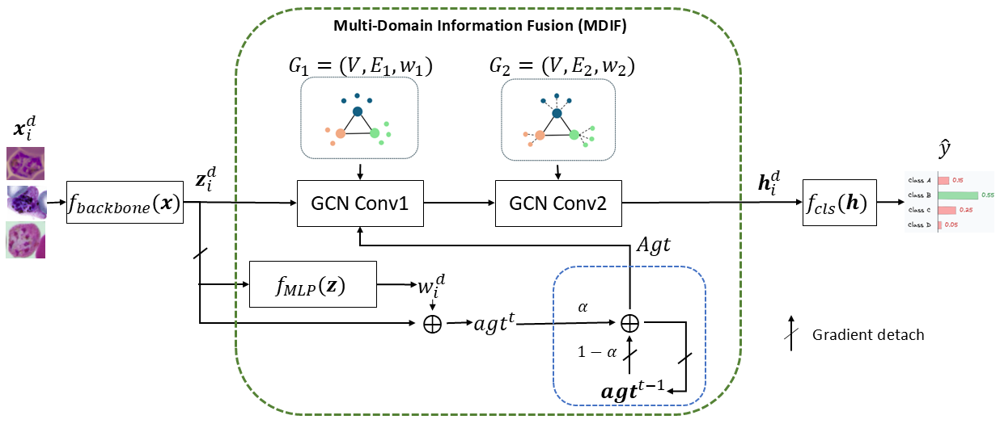

# Multi-Domain Information Fusion (MDIF) for Plasmodium Life Cycle Development Classification

Repository for the the thesis title "Multi-Domain Information Fusion for Plasmodium Life Cycle Development Classification". Full version of the thesis is available [here](https://husteduvn-my.sharepoint.com/:b:/g/personal/khanh_tq190085_sis_hust_edu_vn/EagW9zjNSihGo7q9DetTMrEBnEKpkYsc7VJVKMSVaQdJUg?e=5yziRO). 

The repository was developed based on [MMPreTrain](https://github.com/open-mmlab/mmpretrain), with customized modules for MDIF Implementation. It is also available in [github](https://github.com/khanhtran2101/Multi_Domain_Learning_Malaria_Parasite).

## Overall framework

MDIF is a module placed on top of feature extractor to integrate information across domains. An agent node globally represents a whole domain in Domain-level and one class of one doamin in Class-level setting. Two ways of knowledge graph construction are proposed to represent relationship across domains for information fusion.



## Dataset

We use three datasets for training, namely [BBBC041](https://bbbc.broadinstitute.org/BBBC041/), [IML Malaria](https://www.kaggle.com/datasets/qaziammararshad/iml-malaria/data), and Our Plasmodium. Our Plasmodium dataset is still in progress of being published. We keep you updated!

## Experiment Design

Two baselines and two approaches with MDIF are experimented:
 - Individual Training (baseline 1): model is trained on individual dataset without MDIF.
 - Joint Training (baseline 2): model is trained jointly on all datasets without MDIF.
 - MDIFDomain-level:modelistrainedjointly onall datasets with MDIFDomain
level.
 - MDIF Class-level: model is trained jointly on all datasets with MDIF Class
level.

## How to run experiment? 

Some requirements for running environment includes: PyTorch 2.1.2, Torchvision 0.16.2, mmcv 2.1.0, mmengine

A config file with specific settings, such as dataset and components of model, should be defined to run the experiments. Examples of training and evalution with MDIF Domain-level in Kaggle are shown as following.

Training:
```shell
python tools/train.py /kaggle/input/configs-file/approach2_7class/approach2.1_all_7classes_weightedsampling_kaggle_Dec10.py
```
Evaluation: 
```shell
python tools/test.py /kaggle/input/configs-file/approach2_7class/approach2.1_all_7classes_weightedsampling_kaggle_Dec10.py /kaggle/working/experiment_result/epoch_50.pth
```

All config files to reproduce experiment results is available at [Kaggle dataset](https://www.kaggle.com/datasets/khanhtq2101/configs-file)

Example of setting environment and running on Kaggle: [Individual Training BBBC041](https://www.kaggle.com/code/quockhanh01/baseline1-bbbc041-mmpretrain?scriptVersionId=212608647)
